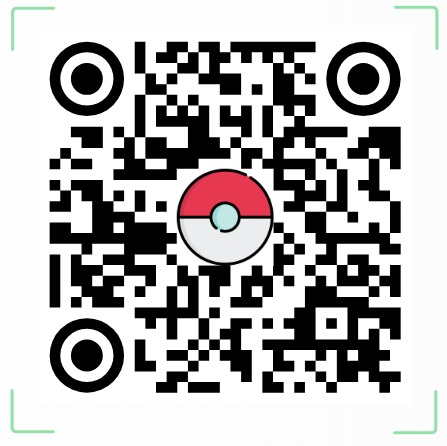

# Pokemon CSS Arena

CSS moderno explicado con Pokemon



Escaneen el QR para ver la pagina en el celular mientras exponemos.

---

## Que hicimos

Construimos una pagina web con tematica Pokemon para mostrar conceptos importantes de CSS moderno de forma visual, simple y entretenida.

La idea no fue solo "decorar", sino usar CSS para:

- organizar layout
- adaptar la pagina a distintos tamanos
- manejar estados visuales
- crear interaccion
- generar efectos y secuencias

---

## Que conceptos cubrimos

- Media queries
- Container queries
- Flexbox
- Grid
- Variables CSS
- Funciones como `calc()` y `clamp()`
- Anidacion de reglas
- Transformaciones
- Transiciones
- Animaciones

---

## Estructura del proyecto

- `main.css`: estilos base, variables, navbar, hero y componentes compartidos
- `loader.css`: pantalla inicial animada
- `transforms.css`: cartas 3D y container queries
- `transitions.css`: evolucion con estados CSS
- `animations.css`: escena de combate con `@keyframes`

---

## Intro, landing y responsive

Tomamos la landing como ejemplo principal de responsive porque es la primera parte que ve el usuario y concentra varias decisiones importantes del proyecto.

La pagina parte con una base comun en CSS:

- variables en `:root`
- layout reutilizable
- flexbox para navegacion y distribucion
- anchos controlados para que el contenido no se estire demasiado
- medidas adaptativas con `clamp()`

Ejemplo:

```css
main {
  width: min(100%, var(--layout-max));
  margin: 0 auto;
  padding: calc(var(--space) * 1.1) calc(var(--space) * 1.2);
}

.hero h1 {
  font-size: clamp(2rem, 5.5vw, 3.9rem);
}
```

Esto hace que la landing:

- no ocupe mas ancho del necesario en pantallas grandes
- mantenga margenes y padding razonables
- haga que el titulo crezca o se reduzca segun el tamano de pantalla
- se vea bien tanto en celular como en escritorio

# CODIGO Y Página

## Uso de IA

Usamos IA como asistente, no como reemplazo del trabajo del grupo.

Nuestra forma de usar IA fue cambiando durante el proyecto:

- al inicio la usamos mas como apoyo conceptual
- nos servia para pedir bases, recordar sintaxis y resolver dudas mientras nosotros mismos ibamos escribiendo
- despues, cuando la idea del proyecto ya estaba mas clara, usamos herramientas mas potentes como Codex para potenciar, ordenar y refinar cosas concretas

Ejemplo de esto:

- este mismo README de presentacion fue iterado con ayuda de Codex
- la estructura e intencion ya la teniamos nosotros
- Codex nos ayudo a transformarla en un material mas claro, presentable y util para exponer

La usamos para:

- proponer ideas visuales
- recordar sintaxis de propiedades modernas
- explorar alternativas de layout y efectos
- iterar prototipos mas rapido

Despues:

- revisamos el codigo
- cambiamos valores y estructura
- descartamos partes que no nos servian
- nos aseguramos de entenderlo antes de presentarlo


**la IA no solo sirvio para generar codigo, tambien sirvio para entenderlo mejor y explicarlo con mas criterio**

---

## Autoevaluacion

Creemos que el trabajo cumple bien con lo pedido porque:

- cubre todos los contenidos obligatorios
- muestra ejemplos concretos y visuales
- usa CSS moderno en situaciones distintas

Lo mejor del proyecto:

- los conceptos no aparecen aislados
- cada tecnica esta aplicada a una experiencia visual

Lo que mejorariamos:

- mas accesibilidad
- mas comentarios didacticos en el codigo
- mas consistencia responsive en detalles finos

---

## Cierre

Nuestro objetivo fue que CSS se entendiera viendo el efecto en accion.

Cada pagina del proyecto toma una tecnica distinta y la transforma en una experiencia visual:

- evolucion para transiciones
- cartas para transformaciones
- combate para animaciones

La idea final es simple:

**aprender CSS moderno de una forma mas memorable**
